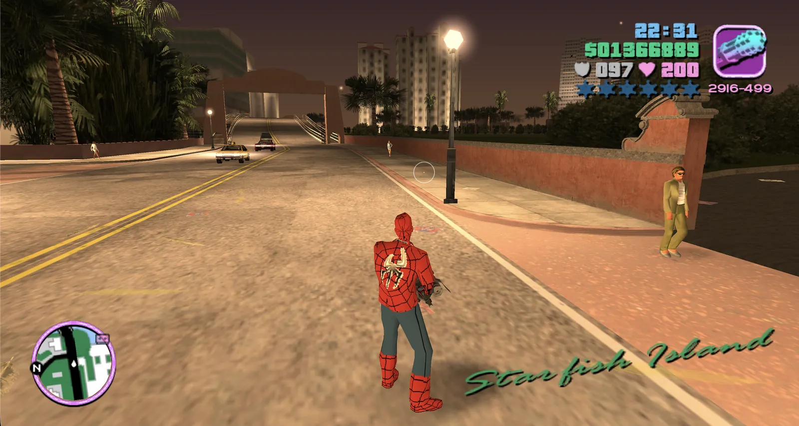

# GTA: Vice City — WASM Port

Play GTA: Vice City right in your browser. Nothing to install: the game runs on your own device and keeps working offline.

[](https://joncodeofficial.github.io/gta-vice-city-wasm/)



You need the game files (`game.tar.gz`) once — see [How it works](#how-it-works).

## What's included

- **Play in your browser.** Nothing to install, and your game files stay on your device.
- **Your own saved games.** Import, export and remove PC saves.
- **Custom skins.** Change how Tommy looks with your own images.
- **Cheats on demand.** Off by default; switch them on from the setup screen.
- **Touch controls.** On-screen controls for phones and tablets.
- **Install it as an app.** Add it to your desktop or home screen from the browser.

## How it works

1. Download `game.tar.gz`
2. Open the [live page](https://joncodeofficial.github.io/gta-vice-city-wasm/) and click **Select game.tar.gz** to import the file
3. The archive is extracted into your browser's local storage (OPFS) — this only happens once
4. Click **Start to play** and the game loads entirely from your device

Your imported data persists between sessions so you only need to import once unless you clear browser storage.

## Saves & skins

Before pressing Start, you can add your own saved games and character skins from the **Saves & skins** section.

### Saves

- Add a saved game downloaded for **GTA Vice City on PC**. Files named `GTAVCsf1.b` to `GTAVCsf8.b`, or a `.zip` containing one, both work.
- Importing into a slot that already has a save replaces it.
- You can download your saves to keep them safe.

### Skins

- Add a skin as a `.bmp`, `.png`, `.jpg` or `.zip` file. It is adjusted automatically.
- Once in game, open *Options → Player Skin Setup*, pick your skin and leave the menu to put it on.
- Skins only change Tommy's everyday outfit.

If your download is a `.rar` or `.7z`, unpack it first. *Reset game data* also deletes your saves and skins.

## Requirements

- A modern desktop browser with WebAssembly + OPFS + Service Worker support
- Recommended: Chrome 110+, Firefox 111+, or Safari 16.4+
- The `game.tar.gz` game archive (~668 MB compressed)

## Running locally

```bash
pnpm install
pnpm dev
```

Then open `http://localhost:5173`.

## Tech stack

- **Vite** — dev server and build tool
- **WebAssembly** — game engine compiled from C++ via Emscripten
- **OPFS** (Origin Private File System) — stores extracted game data locally in the browser
- **Service Worker** — intercepts fetch requests to serve game files from OPFS
- **Web Worker** — extracts the `.tar.gz` archive off the main thread

## Credits

**Browser client port** (OPFS storage, Service Worker, import UI, GitHub Pages deploy):
[@joncodeofficial](https://github.com/joncodeofficial)

**Based on** [reVCDOS](https://github.com/Lolendor/reVCDOS) by [@Lolendor](https://github.com/Lolendor)

**WASM engine port** by the DOS Zone team:
- [@specialist003](https://github.com/okhmanyuk-ev)
- [@caiiiycuk](https://www.youtube.com/caiiiycuk)
- [@SerGen](https://t.me/ser_var)

The game engine is based on the open-source reverse engineering project [re3/reVC](https://github.com/SugaryHull/re3/tree/miami).

## License

This repository's source code is licensed under the [MIT License](LICENSE).

## Disclaimer

This is not a commercial release and is not affiliated with Rockstar Games or Take-Two Interactive. It is built entirely on an open-source reimplementation of the game engine and does not include, distribute, or host any original game assets. You must own a legitimate copy of GTA: Vice City to use this software. All trademarks and copyrights belong to their respective owners.

Any URL, script, or method referenced in this repository for obtaining game assets is provided solely for the maintainer's own development and testing purposes. Its availability is not guaranteed, and no permission is granted to third parties to rehost, hotlink, mirror, or redistribute those assets. The maintainer is not responsible for how third parties use, host, or redistribute game assets referenced or linked from this repository, nor for any consequences arising from unauthorized use of this project or its assets.

This software is provided "as is", without warranty of any kind. See the [LICENSE](LICENSE) file for the full liability disclaimer.
